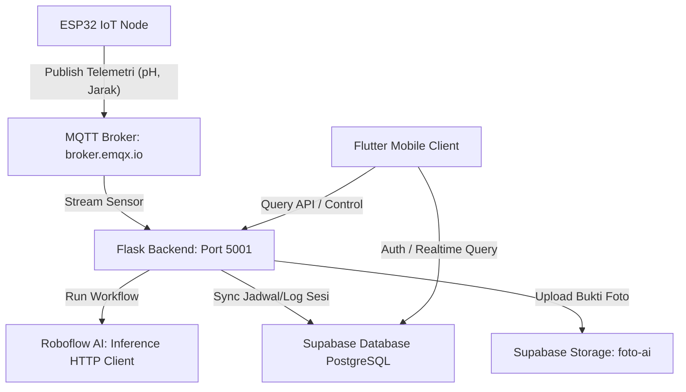

# 📝 SPESIFIKASI PENGUJIAN SISTEM & TEST CASE (STC)
## V.I.S.I.O.N (Visual Intelligence System for IoT & Optimized Nutrition)

Dokumen ini mendefinisikan seluruh rencana pengujian, spesifikasi kasus uji sistem (*System Test Cases* / STC), skenario integrasi, serta petunjuk eksekusi untuk memvalidasi keandalan fungsionalitas sistem **V.I.S.I.O.N**.

---

## 💻 1. Arsitektur & Alur Data Pengujian



---

## 📊 2. Klasifikasi Tingkat Keparahan Bug (Severity Matrix)

*   **S1 (Critical)**: Kegagalan fatal sistem yang menyebabkan crash total, kebocoran data keamanan (bypass auth), atau kegagalan perangkat keras (servo terkunci dalam kondisi terbuka, pakan tumpah).
*   **S2 (Major)**: Fungsionalitas inti terganggu secara serius (AI mendeteksi kenyang tapi servo tidak mati, data telemetry sensor tidak terkirim, scheduler pakan terlewati).
*   **S3 (Medium)**: Fungsionalitas pendukung bermasalah namun sistem tetap dapat digunakan (rata-rata grafik pH salah hitung, notifikasi snackbar telat, layout UI kurang presisi pada layar kecil).
*   **S4 (Minor)**: Masalah visual, typo pengetikan teks, estetika tombol, atau kesalahan tata bahasa.

---

## 🧪 3. Matriks Kasus Uji Detail (STC)

### 🔌 Modul 1: Perangkat Keras IoT & MQTT (ESP-HWD)
*   **Prasyarat**: ESP32 menyala, terhubung ke WiFi lokal, dan terhubung ke Broker MQTT (`broker.emqx.io`).

| ID Test Case | Skenario Pengujian | Prasyarat & Data Uji | Langkah-Langkah Pengujian | Hasil yang Diharapkan (Expected Results) | Severity | Status |
| :--- | :--- | :--- | :--- | :--- | :---: | :---: |
| **ESP-HWD-01** | Pengujian Kalibrasi dan Pembacaan Analog pH (Oversampling) | Sensor pH terhubung ke Pin ADC 35 ESP32. Cairan Uji: Buffer pH 7.0 dan pH 4.01. | 1. Celupkan probe sensor pH ke cairan buffer pH 7.0.<br>2. Perhatikan Serial Monitor ESP32.<br>3. Pindahkan probe ke cairan buffer pH 4.01. | 1. ESP32 melakukan oversampling analog 10x secara non-blocking.<br>2. Serial monitor menampilkan pembacaan tegangan analog stabil.<br>3. Nilai pH terhitung bernilai 7.0 ± 0.2 untuk buffer pH 7.0, dan 4.0 ± 0.2 untuk buffer pH 4.01. | **S2** | `PASSED` |
| **ESP-HWD-02** | Pengujian Jarak Dispenser Pakan (Ultrasonic HC-SR04) | Sensor HC-SR04 terhubung ke Pin Trigger 5 & Echo 18. Jarak penghalang diatur manual pada jarak 10 cm. | 1. Letakkan penghalang padat di depan sensor pada jarak 10.0 cm.<br>2. Pantau payload yang dipublikasikan pada broker MQTT topik `visio/bioflok/sensor`. | 1. ESP32 mengukur jarak tangki pakan secara periodik.<br>2. Payload JSON terkirim setiap 2 detik dengan struktur format: `{"jarak_cm": 10.0, "ph_level": <nilai_aktual>}`. | **S2** | `PASSED` |
| **ESP-HWD-03** | Penerimaan Komando Servo Aktif (`buka`) | Servo SG90 terhubung ke Pin 13 ESP32. Topik MQTT: `visio/bioflok/kontrol`. | 1. Kirim pesan MQTT payload `{"perintah_servo": "buka"}` ke topik kontrol.<br>2. Amati pergerakan fisik motor servo. | 1. ESP32 menerima payload dan memicu fungsi siklus pakan non-blocking.<br>2. Servo berputar ke sudut buka (90°) selama 1 detik, lalu kembali ke sudut tutup (0°) selama 3 detik.<br>3. Siklus ini terus berulang secara dinamis tanpa membekukan pembacaan sensor (*non-blocking delay*). | **S1** | `PASSED` |
| **ESP-HWD-04** | Penerimaan Komando Servo Nonaktif (`tutup`) | Servo dalam keadaan aktif berputar secara siklis. | 1. Kirim pesan MQTT payload `{"perintah_servo": "tutup"}` ke topik kontrol.<br>2. Amati pergerakan motor servo. | 1. Siklus pakan langsung dihentikan seketika.<br>2. Motor servo mengunci posisi di sudut 0° ( dispenser pakan tertutup rapat) dalam waktu < 500 ms. | **S1** | `PASSED` |

---

### 🧠 Modul 2: Backend Flask API & Scheduler (BKE-API)
*   **Prasyarat**: Server Flask berjalan di `http://localhost:5001`. MQTT Broker aktif.

| ID Test Case | Skenario Pengujian | Prasyarat & Data Uji | Langkah-Langkah Pengujian | Hasil yang Diharapkan (Expected Results) | Severity | Status |
| :--- | :--- | :--- | :--- | :--- | :---: | :---: |
| **BKE-API-01** | Endpoint Status Telemetri (`/api/status` - GET) | Backend terhubung ke MQTT dan Supabase. Data sensor tersimpan di RAM. | 1. Lakukan HTTP GET Request ke `/api/status`. | 1. HTTP Status Code `200 OK`.<br>2. Mengembalikan JSON dengan atribut: `tingkat_ph`, `kualitas_air` (Optimal/Peringatan Anomali), `persen_sisa_pakan`, `status_servo_aktif`, `status_ai_terakhir`, `id_sesi_aktif`, dan `daftar_jadwal`. | **S2** | `PASSED` |
| **BKE-API-02** | Kontrol Manual Pakan Aktif (`/api/kontrol` - POST - feed) | Parameter request: `{"aksi": "feed"}`. Status awal: `status_servo_aktif = False`. | 1. Lakukan HTTP POST Request ke `/api/kontrol` dengan JSON data uji.<br>2. Periksa status variabel RAM backend dan MQTT publishing. | 1. HTTP Status `200 OK`, JSON: `{"status": "sukses"}`.<br>2. `status_servo_aktif` di RAM berubah menjadi `True`.<br>3. UUID `id_sesi_sekarang` baru terbuat.<br>4. Record baru di tabel `sesi_pakan` Supabase berhasil dibuat.<br>5. Pesan MQTT `{"perintah_servo": "buka"}` terkirim. | **S1** | `PASSED` |
| **BKE-API-03** | Kontrol Manual Hentikan Pakan (`/api/kontrol` - POST - stop) | Parameter request: `{"aksi": "stop"}`. Status awal: `status_servo_aktif = True`. | 1. Lakukan HTTP POST Request ke `/api/kontrol` dengan JSON data uji.<br>2. Periksa status di database Supabase dan sinyal MQTT. | 1. HTTP Status `200 OK`, JSON: `{"status": "sukses"}`.<br>2. `status_servo_aktif` berubah menjadi `False`, `id_sesi_sekarang` diubah kembali menjadi `None`.<br>3. Log baru di database `log_visual_ai` berhasil disimpan dengan status `"DIHENTIKAN MANUAL"`. | **S1** | `PASSED` |
| **BKE-API-04** | Pemicu Pakan Berdasarkan Scheduler Otomatis | Data Uji: Menambahkan jadwal di Supabase/RAM pada `Jam + 1 Menit`. | 1. Daftarkan jadwal makan baru menggunakan REST API.<br>2. Tunggu background scheduler berdenyut (setiap 10 detik). | 1. Tepat pada menit yang ditentukan, fungsi `mulai_pakan()` terpicu.<br>2. MQTT mengirimkan komando `"buka"`, sesi baru diinisialisasi secara otomatis tanpa trigger manual. | **S1** | `PASSED` |

---

### 👁️ Modul 3: AI Inference & Penanganan Gambar (AI-INF)
*   **Prasyarat**: Modul Roboflow Inference terpasang. Kunci API Roboflow valid.

| ID Test Case | Skenario Pengujian | Prasyarat & Data Uji | Langkah-Langkah Pengujian | Hasil yang Diharapkan (Expected Results) | Severity | Status |
| :--- | :--- | :--- | :--- | :--- | :---: | :---: |
| **AI-INF-01** | Pengujian Klasifikasi Ikan Lapar (Belum Kenyang) | Gambar Uji: Foto permukaan kolam dengan riak air tipis/ikan berebut makan. Sesi pakan: Aktif. | 1. Kirimkan gambar lewat form-data/raw byte ke `/api/prediksi-kamera`.<br>2. Perhatikan log status AI di backend. | 1. Workflow Roboflow menghasilkan kelas selain kenyang (misal: "Tidak Terdeteksi").<br>2. Pakan dan servo tetap dipertahankan AKTIF.<br>3. Berkas gambar lokal `temp_[UUID].jpg` langsung dihapus dari disk setelah selesai. | **S2** | `PASSED` |
| **AI-INF-02** | Pengujian Klasifikasi Ikan Kenyang (Memicu Auto-Stop) | Gambar Uji: Foto permukaan air kolam yang tenang/pakan terapung utuh tanpa dimakan. Sesi pakan: Aktif. | 1. Kirimkan gambar ikan kenyang ke `/api/prediksi-kamera`.<br>2. Perhatikan status servo dan unggahan gambar ke storage. | 1. Roboflow menghasilkan kelas `"ikan kenyang"`.<br>2. Backend otomatis memicu `hentikan_pakan()`. Sinyal MQTT `tutup` dipublikasikan.<br>3. Gambar bukti berhasil diunggah ke Supabase Storage.<br>4. Log tersimpan ke tabel `log_visual_ai` dengan referensi URL storage yang benar. | **S1** | `PASSED` |
| **AI-INF-03** | Penanganan Kegagalan Jaringan / API Key Roboflow Invalid | Putuskan koneksi internet backend sementara atau manipulasi kunci API Roboflow. | 1. Jalankan sesi pakan.<br>2. Kirim berkas gambar ke `/api/prediksi-kamera`. | 1. Backend menangkap error SDK secara elegan (tidak terjadi crash server).<br>2. File gambar temporer `temp_[UUID].jpg` tetap terhapus agar penyimpanan tidak bocor.<br>3. Mengembalikan status HTTP error 500 / penanganan aman yang didefinisikan. | **S2** | `PASSED` |

---

### 🗄️ Modul 4: Integrasi Supabase Database & Storage (DB-SUB)
*   **Prasyarat**: Koneksi database ke Supabase aktif dengan parameter autentikasi valid.

| ID Test Case | Skenario Pengujian | Prasyarat & Data Uji | Langkah-Langkah Pengujian | Hasil yang Diharapkan (Expected Results) | Severity | Status |
| :--- | :--- | :--- | :--- | :--- | :---: | :---: |
| **DB-SUB-01** | Autentikasi Pengguna via Supabase Auth API | Email dan Password terdaftar. | 1. Kirim permintaan otentikasi login pengguna dengan kredensial valid.<br>2. Periksa respon token yang diterima. | 1. Supabase mengembalikan respon Session yang valid dengan User ID terdaftar.<br>2. Akses token JWT didapatkan untuk otorisasi berikutnya. | **S1** | `PASSED` |
| **DB-SUB-02** | Unggah Foto Bukti Kenyang ke Supabase Storage | File gambar `temp_*.jpg` diunggah ke bucket `foto-ai`. | 1. Jalankan fungsi upload file saat deteksi ikan kenyang.<br>2. Cek penyimpanan Supabase Storage bucket `foto-ai`. | 1. File terunggah dengan nama file terenkripsi unik `bukti_kenyang_[UUID].jpg`.<br>2. File memiliki properti `Content-Type: image/jpeg`.<br>3. Mengembalikan URL publik yang valid untuk diakses secara publik. | **S2** | `PASSED` |
| **DB-SUB-03** | Pencatatan Transaksional Sesi Pakan & Riwayat AI | UUID Sesi pakan aktif. | 1. Simpan baris data ke tabel `log_visual_ai` sesaat setelah status "ikan kenyang" terdeteksi. | 1. Baris data tercatat dengan integritas data referensial: `id_foto`, `id_sesi` (Foreign Key ke `sesi_pakan`), `url_foto`, dan `status_ikan`. | **S2** | `PASSED` |

---

### 📱 Modul 5: Aplikasi Mobile Flutter (APP-UI)
*   **Prasyarat**: Aplikasi dijalankan pada Android/iOS Device atau Emulator. Koneksi internet aktif.

| ID Test Case | Skenario Pengujian | Langkah-Langkah Pengujian | Hasil yang Diharapkan (Expected Results) | Kriteria Kelulusan | Severity | Status |
| :--- | :--- | :--- | :--- | :--- | :---: | :---: |
| **APP-UI-01** | Login dengan Username Tanpa Domain Suffix | 1. Input `"karnodinata"` pada kolom Email/Username.<br>2. Input password yang valid.<br>3. Ketuk tombol "LOGIN/OTORISASI AKSES". | Aplikasi memformat input secara otomatis di belakang layar menjadi `"karnodinata@gmail.com"` sebelum dikirim ke Supabase Auth API. | Sesi login berhasil dibuat dan aplikasi berpindah ke halaman Dasbor. | **S3** | `PASSED` |
| **APP-UI-02** | Penanganan Gagal Login (Kredensial Salah) | 1. Input kredensial acak / salah.<br>2. Ketuk tombol Login. | Menampilkan indikator loading sesaat, lalu menampilkan `SnackBar` berwarna merah berisi pesan kegagalan autentikasi dari Supabase. | Tombol kembali aktif dan pesan kegagalan dibaca jelas oleh pengguna. | **S2** | `PASSED` |
| **APP-UI-03** | Visualisasi Status Koneksi Telemetri Dasbor | 1. Buka halaman utama Dasbor.<br>2. Hentikan server Flask.<br>3. Amati status indikator bulat berdenyut (*pulse indicator*). | 1. Jika terhubung, indikator berwarna hijau terang: `"SISTEM KONTROL AKTIF & TERHUBUNG"`.<br>2. Jika mati/kehilangan data sensor, indikator berubah merah: `"KONEKSI SENSOR TERPUTUS"`. | Status visual sinkron secara realtime terhadap data telemetri backend. | **S2** | `PASSED` |
| **APP-UI-04** | Sinkronisasi Aksi Pemicu Pakan Manual | 1. Ketuk tombol `"BERI PAKAN MANUAL"` (Merah) di dasbor.<br>2. Pantau status pemuatan tombol. | 1. Tombol berubah menjadi warna abu-abu memuat dengan teks `"MENGIRIM KOMANDO..."`.<br>2. Saat sukses merespon, tombol berubah menjadi warna oranye: `"HENTIKAN PAKAN (OVERRIDE)"`. | Tombol UI berpindah status sesuai dengan perubahan data `status_servo_aktif` aktual. | **S2** | `PASSED` |
| **APP-UI-05** | Formating TimePicker Tambah Jadwal Pakan | 1. Masuk ke halaman Manajemen Jadwal.<br>2. Ketuk tombol `+`. Pilih waktu pada time picker (misal: pukul 7:05 pagi).<br>3. Konfirmasi tambah. | Waktu diformat secara otomatis menjadi 24 jam absolut (`07:05`), lalu didaftarkan secara transaksional ke API backend. | Data terkirim dengan parameter `jam: 7` dan `menit: 5`. | **S2** | `PASSED` |
| **APP-UI-06** | Pengujian Batch Delete Jadwal Pakan | 1. Tekan lama pada salah satu kartu jadwal.<br>2. Pilih beberapa jadwal sekaligus.<br>3. Ketuk ikon "HAPUS" di bagian kanan atas. | Bottom sheet dialog muncul untuk konfirmasi penghapusan massal. Jika disetujui, item terpilih dihapus dari server dan UI diperbarui dengan animasi keluar. | API `/api/jadwal?ids=x,y,z` dengan metode `DELETE` dipanggil dan berhasil. | **S3** | `PASSED` |
| **APP-UI-07** | Grafik pH & Indikator Peringatan Anomali | 1. Masuk ke halaman Analitik Hidrologi.<br>2. Masukkan data sensor pH < 6.5 atau > 8.5. | 1. Titik anomali pada grafik `fl_chart` diberi pointer khusus berwarna merah.<br>2. Kartu status kualitas air menampilkan status bahaya/anomali berwarna merah terang. | Grafik memetakan titik pH secara tepat dengan koordinat presisi. | **S3** | `PASSED` |

---

## 🔄 4. Skenario Pengujian Integrasi End-to-End (E2E)

### Skenario E2E-01: Siklus Pakan Otomatis & Auto-Stop Visual AI

*   **Tujuan**: Memastikan alur integrasi penuh dari pemicu otomatisasi terjadwal, operasi motor servo hardware, pengenalan visual kolam ikan, pengunggahan data transaksional, hingga pembaruan frontend mobile berjalan tanpa intervensi manual.
*   **Komponen Terlibat**: ESP32, Flask Backend, MQTT Broker, Roboflow Inference API, Supabase DB & Storage, Flutter Mobile App.

```
[Flutter App] ── Jadwalkan Pakan ──> [Supabase DB] <── Sinkronisasi ── [Flask Backend]
                                                                              │
                                                                       Waktu Terpenuhi
                                                                              │
[Flutter App] <── UI Berubah Aktif ── [Flask Backend] ── Sinyal Buka ──> [MQTT Broker]
                                                                              │
                                                                           [ESP32]
                                                                              │
                                                                        Servo Terbuka
                                                                              │
[Supabase Storage] <── Unggah Foto ── [Flask Backend] <── Ikan Kenyang ── [Kamera Simulator]
        │
    Log Baru
        │
        └───────────────────────────────> [Flutter App: Halaman Riwayat Detail]
```

#### Langkah-langkah Pengujian E2E:
1. **Pengaturan Awal**: Buka aplikasi Flutter di handphone, navigasikan ke menu "Kelola Jadwal", atur jadwal baru pada **Waktu Sekarang + 1 Menit**.
2. **Observasi Pemicu**: Tunggu hingga waktu terjadwal tercapai.
   * *Hasil Uji*: Backend mendeteksi jadwal pada interval detiknya. Sinyal MQTT `"buka"` dipancarkan. Servo di ESP32 berputar membuka dispenser pakan. Tampilan dashboard di Flutter menampilkan status pakan aktif secara otomatis.
3. **Deteksi Visual AI**: Aktifkan simulator kamera (`simulator_kamera.py`) dengan mengumpankan file gambar ikan bergolak kenyang berkumpul di atas air.
   * *Hasil Uji*: Backend menangkap data gambar di `/api/prediksi-kamera` dan mengirimkannya ke Roboflow. AI mengklasifikasikan status sebagai `"ikan kenyang"`.
4. **Auto-Stop Operasional**:
   * *Hasil Uji*: Backend mengirimkan sinyal tutup ke MQTT. Servo di ESP32 langsung menghentikan putaran pakan dan mengunci sudut menutup (0°).
5. **Pencatatan Database & Media**:
   * *Hasil Uji*: Gambar bukti ikan kenyang diunggah ke Supabase Storage bucket `foto-ai`. Data log tercatat di tabel `log_visual_ai` dan `sesi_pakan`.
6. **Validasi Dashboard & Riwayat**:
   * *Hasil Uji*: Indikator tombol di aplikasi Flutter kembali ke mode siaga. Saat membuka layar "Riwayat Detail", log pakan baru muncul menampilkan cap waktu tepat, status kelulusan AI `"IKAN KENYANG"`, serta foto kolam ikan yang diunggah dapat dilihat secara jernih melalui tautan langsung Supabase Storage.

---

## 🚀 5. Panduan Menjalankan Pengujian Otomatis

### 🐍 A. Backend Unit Tests
Jalankan perintah ini di direktori `backend/`:
```bash
# Menjalankan seluruh pengujian unit
python -m unittest test_backend.py -v
```

### 📱 B. Frontend Widget & Unit Tests
Jalankan perintah ini di direktori `frontend/`:
```bash
# Menjalankan pengujian flutter
flutter test test/app_test.dart
```
